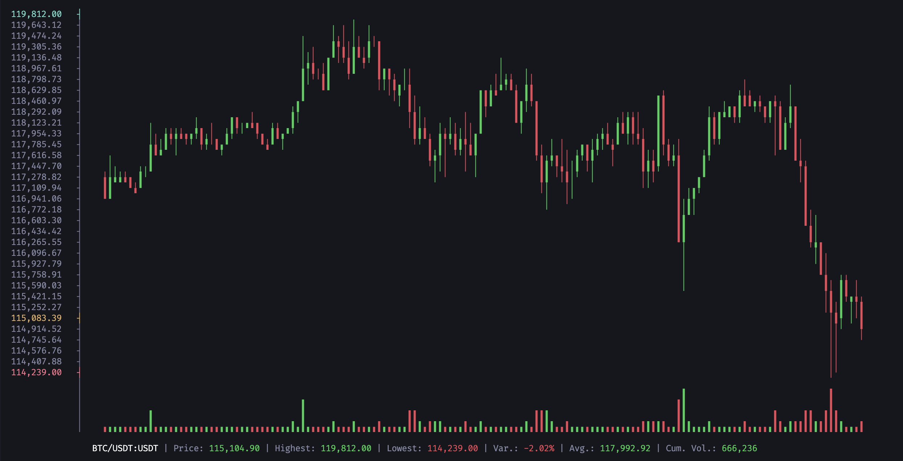

# Candlestick-CLI 📈

[](https://www.npmjs.com/package/@neabyte/candlestick-cli)
[](https://www.npmjs.com/package/@neabyte/candlestick-cli)
[](https://github.com/NeaByteLab/Candlestick-CLI/blob/main/LICENSE)
[](https://www.typescriptlang.org/)
[](https://nodejs.org/)

Creating professional candlestick charts directly in your terminal, built with modern TypeScript and designed for developers who need real-time financial data visualization without leaving their terminal environment.

<p align="center">



</p>

<div align="center">

*See [CHANGELOG.md](./CHANGELOG.md) for version history and updates.*

</div>

---

## ✨ Features

- 🎨 **Unicode Candlestick Charts** - High-quality visualization with Unicode characters
- 📊 **Live Market Data** - Real-time data from cryptocurrency exchanges via CCXT
- 🎛️ **Customizable Colors** - Set custom bullish/bearish colors with RGB values
- 📏 **Auto-fit Terminal** - Automatically adjusts to terminal size
- 📈 **Volume Pane** - Optional volume bars display with Unicode characters
- 🎯 **Price Highlighting** - Highlight specific price levels with custom colors
- 🔧 **Flexible API** - Use as library or standalone CLI tool
- ⚡ **TypeScript** - Full type safety and modern development
- 🖥️ **Terminal Optimized** - Designed specifically for terminal display
- 🚀 **CCXT Integration** - Built-in support for multiple trading exchanges
- 📤 **Export Support** - Export charts as PNG images or text files
- 🔄 **Watch Mode** - Real-time updates with customizable intervals
- 📱 **Smart Scaling** - Auto-fit, fixed, and price-based scaling modes
- 🎨 **Theme Support** - Dark and light background themes for exports
- 📊 **High-Resolution Exports** - Scalable PNG exports with custom quality
- 📈 **Volume Analysis** - Volume pane with bearish/bullish color coding
- 🌐 **Multiple Timeframes** - Support for 1m to 1M timeframes

---

## 📦 Installation

```bash
npm install @neabyte/candlestick-cli
```

Or clone and install locally:

```bash
git clone https://github.com/NeaByteLab/Candlestick-CLI.git
cd Candlestick-CLI
npm install
```

---

## 🚀 Quick Start

### 📋 Library Usage

```typescript
import { Chart } from '@neabyte/candlestick-cli'

const candles = [
  { open: 100, high: 105, low: 99, close: 103, volume: 1000, timestamp: 1640995200000, type: 1 },
  { open: 103, high: 108, low: 102, close: 106, volume: 1200, timestamp: 1640998800000, type: 1 },
  { open: 106, high: 110, low: 104, close: 109, volume: 1500, timestamp: 1641002400000, type: 1 }
]

const chart = new Chart(candles, { title: 'BTC/USDT', width: 120, height: 30 })
chart.draw() // Renders beautiful Unicode candlestick chart in terminal
```

### 💻 CLI Usage

#### Global Installation (Recommended)
```bash
# Install globally
npm install -g @neabyte/candlestick-cli

# Display chart from CSV file
candlestick-cli -f data.csv -t "BTC/USDT"

# Display chart from JSON file with custom colors
candlestick-cli -f data.json --bear-color "#ff6b6b" --bull-color "#51cf66"

# Display chart without volume pane
candlestick-cli -f data.csv --no-volume

# Display chart with custom dimensions
candlestick-cli -f data.csv -w 120 -h 30

# Live market data from cryptocurrency exchange
candlestick-cli -s BTC/USDT --timeframe 4h --limit 200

# Perpetual futures trading
candlestick-cli -s BTC/USDT:USDT --timeframe 1h --limit 150

# Watch mode with real-time updates
candlestick-cli -s BTC/USDT --watch --interval 30

# Export chart as PNG image (dark theme)
candlestick-cli -s BTC/USDT -o chart.png --background dark

# Export chart as PNG image (light theme)
candlestick-cli -s BTC/USDT -o chart.png --background light

# Export chart as text file
candlestick-cli -f data.csv -o chart.txt

# Custom volume height
candlestick-cli -f data.csv --volume-height 12

# Multiple timeframes
candlestick-cli -s BTC/USDT --timeframe 1m --limit 100
candlestick-cli -s BTC/USDT --timeframe 15m --limit 200
candlestick-cli -s BTC/USDT --timeframe 1d --limit 50

**Note**: Export dimensions are automatically optimized for best quality.
```

#### Local Installation
```bash
# Run with npx (if not installed globally)
npx @neabyte/candlestick-cli -f data.csv -t "BTC/USDT"

# Live data with npx
npx @neabyte/candlestick-cli -s BTC/USDT --timeframe 1h --limit 100
```

---

## 📚 Documentation

### 📖 **Complete API Reference**
- **[API Reference](./docs/api-reference.md)** - API documentation with all classes, methods, and types
- **[CLI Reference](./docs/cli-reference.md)** - Complete command-line interface documentation
- **[Examples Guide](./docs/examples.md)** - Detailed usage examples and patterns
- **[Documentation Home](./docs/README.md)** - Overview of all available documentation

### 🎯 **Key Documentation Sections**
- **Chart Class** - Main chart rendering and configuration
- **CLI Interface** - Command-line tool usage and options
- **Data Processing** - CSV/JSON parsing and real-time data
- **CCXT Integration** - Live market data from cryptocurrency exchanges
- **Export Features** - PNG image and text file export capabilities
- **Error Handling** - Custom error types and validation
- **TypeScript Types** - Complete type definitions and interfaces

---

## 🔗 Related Projects

- **[Rust Version](https://github.com/Julien-R44/cli-candlestick-chart)** by [Julien-R44](https://github.com/Julien-R44)
- **[Python Version](https://github.com/BoboTiG/py-candlestick-chart)** by [BoboTiG](https://github.com/BoboTiG)

---

## 🤝 Contributing

Contributions are welcome! Please see [CONTRIBUTING.md](./CONTRIBUTING.md) for detailed guidelines on:

- Development setup and workflow
- Code style and standards
- Testing requirements
- Areas for contribution
- Pull request process

---

## 📄 License

MIT License - see [LICENSE](./LICENSE) for details.